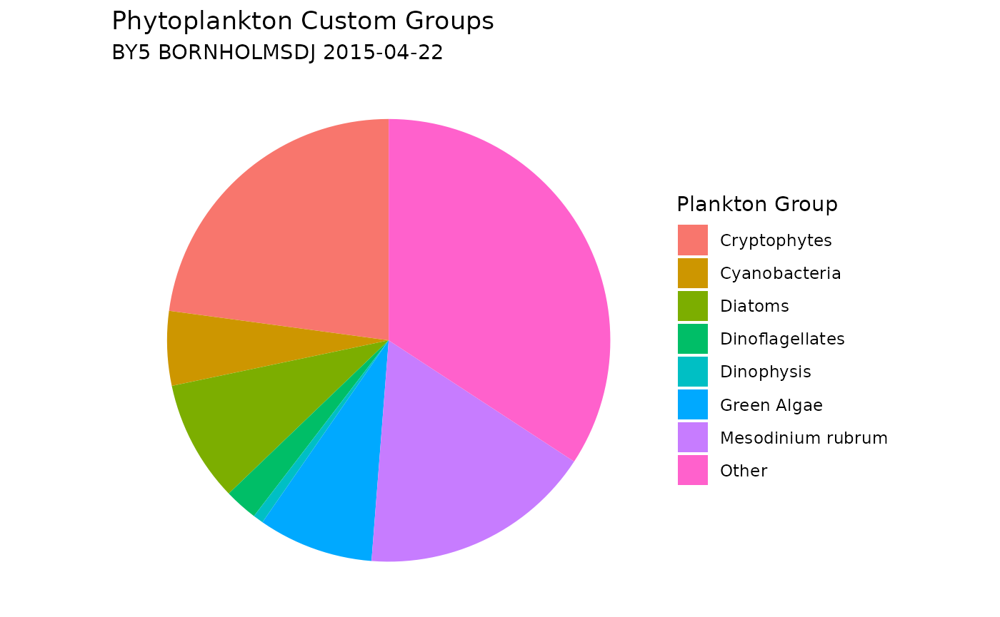

# Retrieve Taxonomic Data From WoRMS

## WoRMS

The World Register of Marine Species (WoRMS) is a comprehensive database
providing authoritative lists of marine organism names, managed by
taxonomic experts. It combines data from the Aphia database and other
sources like AlgaeBase and FishBase, offering species names, higher
classifications, and additional data. WoRMS is continuously updated and
maintained by taxonomists. In this tutorial, we source the R package
[`worrms`](https://CRAN.R-project.org/package=worrms) to access WoRMS
data for our function. Please note that the authors of `SHARK4R` are not
affiliated with WoRMS.

## Getting Started

#### Installation

You can install the latest version of `SHARK4R` from CRAN using:

``` r
install.packages("SHARK4R")
```

Load the `SHARK4R`, `dplyr` and `ggplot2` libraries:

``` r
library(SHARK4R)
library(dplyr)
library(ggplot2)
```

## Retrieve Data Using SHARK4R

### Retrieve Phytoplankton Data From SHARK

Phytoplankton data, including scientific names and AphiaIDs, are
downloaded from SHARK. To see more download options, please visit the
[Retrieve Data From
SHARK](https://sharksmhi.github.io/SHARK4R/articles/retrieve_shark_data.html)
tutorial.

``` r
# Retrieve all phytoplankton data from April 2015
shark_data <- get_shark_data(fromYear = 2015, 
                             toYear = 2015,
                             months = 4, 
                             dataTypes = "Phytoplankton",
                             verbose = FALSE)
```

### Match Taxa Names

Taxon names can be matched with the WoRMS API to retrieve Aphia IDs and
corresponding taxonomic information. The
[`match_worms_taxa()`](https://sharksmhi.github.io/SHARK4R/reference/match_worms_taxa.md)
function incorporates retry logic to handle temporary failures, ensuring
that all names are processed successfully.

``` r
# Find taxa without Aphia ID
no_aphia_id <- shark_data %>%
  filter(is.na(aphia_id))

# Randomly select taxa with missing aphia_id
taxa_names <- sample(unique(no_aphia_id$scientific_name), 
                     size = 10,
                     replace = TRUE)

# Match taxa names with WoRMS
worms_records <- match_worms_taxa(unique(taxa_names),
                                  fuzzy = TRUE,
                                  best_match_only = TRUE,
                                  marine_only = TRUE,
                                  verbose = FALSE)

# Print result as tibble
tibble(worms_records)
```

    ## # A tibble: 4 × 29
    ##   name        status AphiaID rank  scientificname url   authority unacceptreason
    ##   <chr>       <chr>    <int> <chr> <chr>          <chr> <chr>     <chr>         
    ## 1 Unicell     no co…      NA NA    NA             NA    NA        NA            
    ## 2 Scrippsiel… accep…  109545 Genus Scrippsiella   http… Balech e… NA            
    ## 3 Cylindroth… accep…  149004 Spec… Cylindrotheca… http… (Ehrenbe… NA            
    ## 4 Diplopsalis accep…  109515 Genus Diplopsalis    http… R.S.Berg… NA            
    ## # ℹ 21 more variables: taxonRankID <int>, valid_AphiaID <int>,
    ## #   valid_name <chr>, valid_authority <chr>, parentNameUsageID <int>,
    ## #   originalNameUsageID <int>, kingdom <chr>, phylum <chr>, class <chr>,
    ## #   order <chr>, family <chr>, genus <chr>, citation <chr>, lsid <chr>,
    ## #   isMarine <int>, isBrackish <int>, isFreshwater <int>, isTerrestrial <int>,
    ## #   isExtinct <lgl>, match_type <chr>, modified <chr>

### Get WoRMS records from AphiaID

Taxonomic records can also be retrieved using Aphia IDs, employing the
same retry and error-handling logic as the
[`match_worms_taxa()`](https://sharksmhi.github.io/SHARK4R/reference/match_worms_taxa.md)
function.

``` r
# Randomly select ten Aphia IDs
aphia_ids <- sample(unique(shark_data$aphia_id), 
                    size = 10)

# Remove NAs
aphia_ids <- aphia_ids[!is.na(aphia_ids)]

# Retrieve records
worms_records <- get_worms_records(aphia_ids,
                                   verbose = FALSE)

# Print result as tibble
tibble(worms_records)
```

    ## # A tibble: 10 × 28
    ##    AphiaID url        scientificname authority status unacceptreason taxonRankID
    ##      <int> <chr>      <chr>          <chr>     <chr>  <lgl>                <int>
    ##  1 1310442 https://w… Octactis spec… (Ehrenbe… accep… NA                     220
    ##  2  146715 https://w… Aphanothece    Nägeli, … accep… NA                     180
    ##  3  837459 https://w… Tripos lineat… (Ehrenbe… accep… NA                     220
    ##  4  134529 https://w… Pyramimonas    Schmarda… accep… NA                     180
    ##  5  575737 https://w… Binuclearia l… (Schmidl… accep… NA                     220
    ##  6  110153 https://w… Heterocapsa t… (Ehrenbe… unacc… NA                     220
    ##  7  148899 https://w… Bacillariophy… Haeckel,… accep… NA                      60
    ##  8  106287 https://w… Hemiselmis     Parke, 1… accep… NA                     180
    ##  9  249711 https://w… Desmodesmus    (R.Choda… accep… NA                     180
    ## 10  109553 https://w… Protoperidini… Bergh, 1… accep… NA                     180
    ## # ℹ 21 more variables: rank <chr>, valid_AphiaID <int>, valid_name <chr>,
    ## #   valid_authority <chr>, parentNameUsageID <int>, originalNameUsageID <int>,
    ## #   kingdom <chr>, phylum <chr>, class <chr>, order <chr>, family <chr>,
    ## #   genus <chr>, citation <chr>, lsid <chr>, isMarine <int>, isBrackish <int>,
    ## #   isFreshwater <int>, isTerrestrial <int>, isExtinct <lgl>, match_type <chr>,
    ## #   modified <chr>

### Get WoRMS Taxonomy

SHARK sources taxonomic information from
[Dyntaxa](https://artfakta.se/), which is reflected in columns starting
with `taxon_xxxxx`. Equivalent columns based on WoRMS can be retrieved
using the
[`add_worms_taxonomy()`](https://sharksmhi.github.io/SHARK4R/reference/add_worms_taxonomy.md)
function.

``` r
# Retrieve taxonomic table
worms_taxonomy <- add_worms_taxonomy(aphia_ids,
                                     verbose = FALSE)

# Print result as tibble
tibble(worms_taxonomy)
```

    ## # A tibble: 10 × 10
    ##    aphia_id worms_scientific_name    worms_kingdom worms_phylum     worms_class 
    ##       <dbl> <chr>                    <chr>         <chr>            <chr>       
    ##  1  1310442 Octactis speculum        Chromista     Ochrophyta       Dictyochoph…
    ##  2   146715 Aphanothece              Bacteria      Cyanobacteria    Cyanophyceae
    ##  3   837459 Tripos lineatus          Chromista     Myzozoa          Dinophyceae 
    ##  4   134529 Pyramimonas              Plantae       NA               Pyramimonad…
    ##  5   575737 Binuclearia lauterbornii Plantae       NA               Ulvophyceae 
    ##  6   110153 Heterocapsa triquetra    Chromista     Myzozoa          Dinophyceae 
    ##  7   148899 Bacillariophyceae        Chromista     Heterokontophyta Bacillariop…
    ##  8   106287 Hemiselmis               Chromista     Cryptophyta      Cryptophyce…
    ##  9   249711 Desmodesmus              Plantae       NA               Chlorophyce…
    ## 10   109553 Protoperidinium          Chromista     Myzozoa          Dinophyceae 
    ## # ℹ 5 more variables: worms_order <chr>, worms_family <chr>, worms_genus <chr>,
    ## #   worms_species <chr>, worms_hierarchy <chr>

``` r
# Enrich data with data from WoRMS
shark_data_with_worms <- shark_data %>%
  left_join(worms_taxonomy, by = "aphia_id")
```

### Retrieve WoRMS Taxonomic Hierarchies

To explore the full hierarchical taxonomy records of your Aphia IDs, you
can use the
[`get_worms_taxonomy_tree()`](https://sharksmhi.github.io/SHARK4R/reference/get_worms_taxonomy_tree.md)
function. This function retrieves records for the entire taxonomic tree
from WoRMS, including parent-child relationships, and can optionally
fetch all descendants (e.g. species) under a genus or known synonyms.

``` r
# Retrieve taxonomic tree
worms_tree <- get_worms_taxonomy_tree(
  aphia_ids[1],                # use first id only in this example
  add_descendants = FALSE,     # only retrieve hierarchy for given AphiaIDs
  add_synonyms = FALSE,        # do not retrieve synonyms
  verbose = FALSE              # suppress progress messages
)

# Print as tibble for easier viewing
tibble(worms_tree)
```

    ## # A tibble: 9 × 28
    ##   AphiaID url   scientificname authority status unacceptreason taxonRankID rank 
    ##     <int> <chr> <chr>          <chr>     <chr>  <lgl>                <int> <chr>
    ## 1       7 http… Chromista      NA        accep… NA                      10 King…
    ## 2  582419 http… Harosa         NA        accep… NA                      20 Subk…
    ## 3  368898 http… Heterokonta    NA        accep… NA                      25 Infr…
    ## 4  345465 http… Ochrophyta     Cavalier… accep… NA                      30 Phyl…
    ## 5  146232 http… Dictyochophyc… P.C. Sil… accep… NA                      60 Class
    ## 6  157256 http… Dictyochales   Haeckel,… accep… NA                     100 Order
    ## 7  157257 http… Dictyochaceae  Lemmerma… accep… NA                     140 Fami…
    ## 8  369960 http… Octactis       J.Schill… accep… NA                     180 Genus
    ## 9 1310442 http… Octactis spec… (Ehrenbe… accep… NA                     220 Spec…
    ## # ℹ 20 more variables: valid_AphiaID <int>, valid_name <chr>,
    ## #   valid_authority <chr>, parentNameUsageID <int>, originalNameUsageID <int>,
    ## #   kingdom <chr>, phylum <chr>, class <chr>, order <chr>, family <chr>,
    ## #   genus <chr>, citation <chr>, lsid <chr>, isMarine <int>, isBrackish <int>,
    ## #   isFreshwater <int>, isTerrestrial <int>, isExtinct <lgl>, match_type <chr>,
    ## #   modified <chr>

### Assign Phytoplankton Groups

Phytoplankton data are often categorized into major groups such as
Dinoflagellates, Diatoms, Cyanobacteria, and Others. This grouping can
be achieved by referencing information from WoRMS and assigning taxa to
these groups based on their taxonomic classification, as demonstrated in
the example below.

``` r
# Subset data from one national monitoring station
nat_stations <- shark_data %>%
  filter(station_name %in% c("BY5 BORNHOLMSDJ"))

# Randomly select one sample from the nat_stations
sample <- sample(unique(nat_stations$shark_sample_id_md5), 1)

# Subset the random sample
shark_data_subset <- shark_data %>%
  filter(shark_sample_id_md5 == sample)

# Assign groups by providing both scientific name and Aphia ID
plankton_groups <- assign_phytoplankton_group(
  scientific_names = shark_data_subset$scientific_name,
  aphia_ids = shark_data_subset$aphia_id,
  verbose = FALSE)

# Print result
tibble(distinct(plankton_groups))
```

    ## # A tibble: 23 × 2
    ##    scientific_name      plankton_group 
    ##    <chr>                <chr>          
    ##  1 Pauliella taeniata   Diatoms        
    ##  2 Amylax triacantha    Dinoflagellates
    ##  3 Aphanocapsa          Cyanobacteria  
    ##  4 Aphanothece          Cyanobacteria  
    ##  5 Chaetoceros similis  Diatoms        
    ##  6 Dinobryon balticum   Other          
    ##  7 Dinophysis acuminata Dinoflagellates
    ##  8 Dinophysis norvegica Dinoflagellates
    ##  9 Gymnodinium          Dinoflagellates
    ## 10 Protodinium simplex  Other          
    ## # ℹ 13 more rows

``` r
# Add plankton groups to data and summarize abundance results
plankton_group_sum <- shark_data_subset %>%
  mutate(plankton_group = plankton_groups$plankton_group) %>%
  filter(parameter == "Abundance") %>%
  group_by(plankton_group) %>%
  summarise(sum_plankton_groups = sum(value, na.rm = TRUE))

# Plot a pie chart
ggplot(plankton_group_sum, 
       aes(x = "", y = sum_plankton_groups, fill = plankton_group)) +
  geom_col(width = 1) +
  coord_polar(theta = "y") +
  labs(
    title = "Phytoplankton Groups",
    subtitle = paste(unique(shark_data_subset$station_name),
                     unique(shark_data_subset$sample_date)),
    fill = "Plankton Group"
  ) +
  theme_void() +
  theme(plot.background = element_rect(fill = "white", color = NA))
```



#### Assign Custom Phytoplankton Groups

You can add custom plankton groups by using the `custom_groups`
parameter, allowing flexibility to categorize plankton based on specific
taxonomic criteria. Please note that the order of the list matters: taxa
are assigned to the last matching group. For example: Mesodinium rubrum
will be excluded from the Ciliates group because it appears after
Ciliates in the list in the example below.

``` r
# Define custom plankton groups using a named list
custom_groups <- list(
  "Cryptophytes" = list(class = "Cryptophyceae"),
  "Green Algae" = list(class = c("Trebouxiophyceae", 
                                 "Chlorophyceae", 
                                 "Pyramimonadophyceae"),
                       phylum = "Chlorophyta"),
  "Ciliates" = list(phylum = "Ciliophora"),
  "Mesodinium rubrum" = list(scientific_name = "Mesodinium rubrum"),
  "Dinophysis" = list(genus = "Dinophysis")
)

# Assign groups by providing scientific name only, and adding custom groups
plankton_groups <- assign_phytoplankton_group(
  scientific_names = shark_data_subset$scientific_name,
  custom_groups = custom_groups,
  verbose = FALSE)

# Add new plankton groups to data and summarize abundance results
plankton_custom_group_sum <- shark_data_subset %>%
  mutate(plankton_group = plankton_groups$plankton_group) %>%
  filter(parameter == "Abundance") %>%
  group_by(plankton_group) %>%
  summarise(sum_plankton_groups = sum(value, na.rm = TRUE))

# Plot a new pie chart, including the custom groups
ggplot(plankton_custom_group_sum, 
       aes(x = "", y = sum_plankton_groups, fill = plankton_group)) +
  geom_col(width = 1) +
  coord_polar(theta = "y") +
  labs(
    title = "Phytoplankton Custom Groups",
    subtitle = paste(unique(shark_data_subset$station_name),
                     unique(shark_data_subset$sample_date)),
    fill = "Plankton Group"
  ) +
  theme_void() +
  theme(plot.background = element_rect(fill = "white", color = NA))
```


------------------------------------------------------------------------

## Citation

    ## To cite package 'SHARK4R' in publications use:
    ## 
    ##   Lindh, M. and Torstensson, A. (2025). SHARK4R: Accessing and
    ##   Validating Marine Environmental Data from 'SHARK' and Related
    ##   Databases. R package version 1.0.1.
    ##   https://CRAN.R-project.org/package=SHARK4R
    ## 
    ## A BibTeX entry for LaTeX users is
    ## 
    ##   @Manual{,
    ##     title = {SHARK4R: Accessing and Validating Marine Environmental Data from 'SHARK' and Related Databases},
    ##     author = {Markus Lindh and Anders Torstensson},
    ##     year = {2025},
    ##     note = {R package version 1.0.1},
    ##     url = {https://CRAN.R-project.org/package=SHARK4R},
    ##   }
